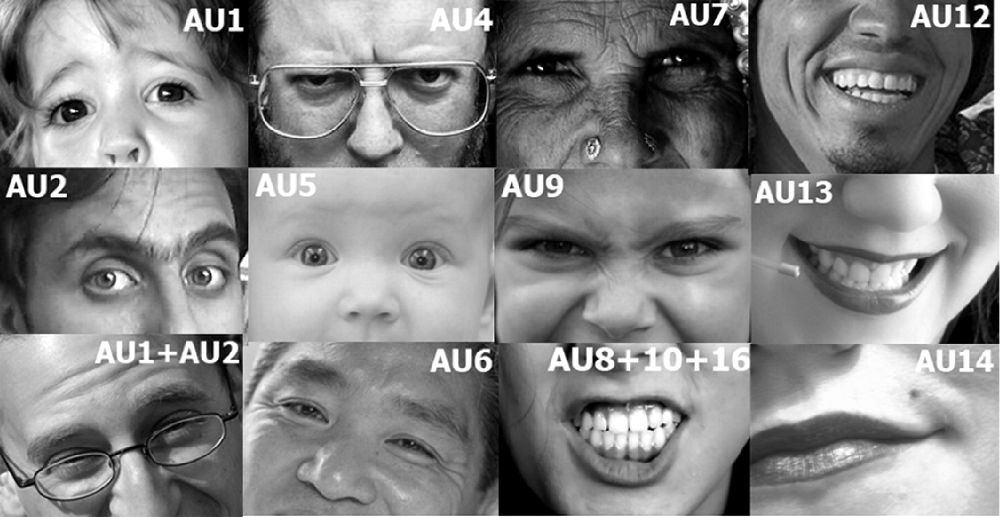

# Emotion recognition from images and wideo

This repository contains a semester project from the course Image and Video Analysis 
in the field of data science at the Faculty of Computer Science and Management 
at the Wrocław University of Technology.

----

## Dataset

We used [FER+](https://github.com/microsoft/FERPlus) 
dataset. It includes 35, 887 images 
with labels from the collection
("neutral", "happiness", "surprise", 
"sadness", "anger", "disgust", "fear", 
"contempt", "unknown", "NF"). The first 
eight labels relate to emotions, 
and the other two were marked when 
the annotator was unsure or when the 
file was missing. Each photo was 
annotated by 10 annotators.

## Tools
We used the [OpenFace 2.0](https://github.com/TadasBaltrusaitis/OpenFace) 
library to find action units and facial landmarks 
on images and video.

## Ours solution 
We compared two approaches:
* Feature extraction 
* End-to-end models

In addition, we counted the entropies of the annotations in the dataset and 
eliminated data that was very inconsistent. 

In the first approach we used the 
data returned by the OpenFace library. We used 
Random Forest classifier and simple
neural network for classification. 

## Results
In the end, deep end-to-end neural 
networks were found to produce better results. 

The best results for the feature extraction 
approach were obtained for the Random Forest classifier (65% of the 
dataset was well marked against the cosine similarity measure).
## Examples

## Authors
* Dziwiński Jakub
* Jabłońska Katarzyna ([katarzyna-jabłońska](https://github.com/katarzyna-jablonska))
